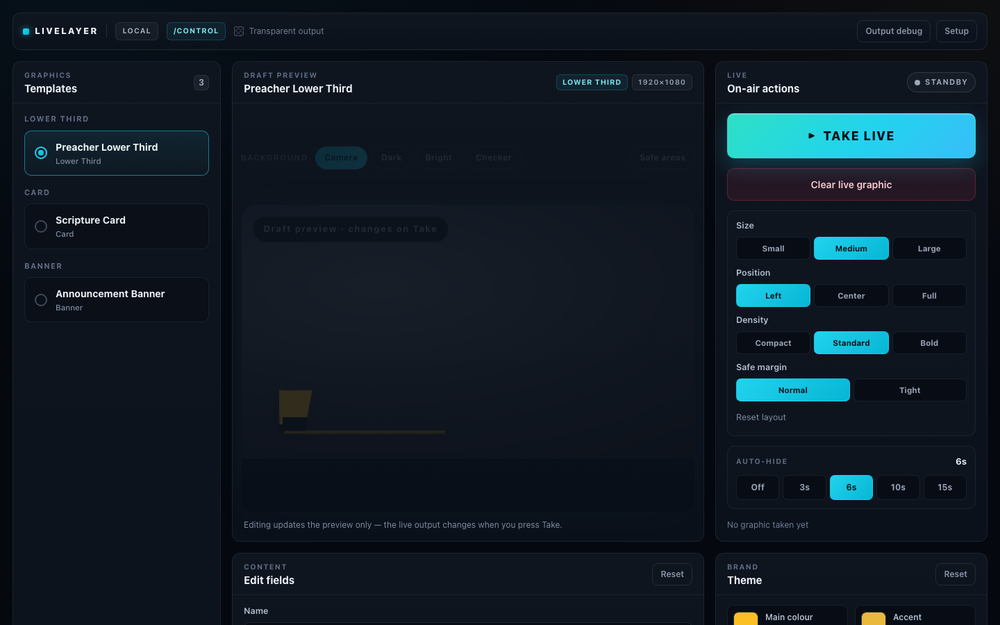

<p align="center">
  
</p>

# LiveLayer

**Local-first broadcast graphics for OBS — a control dock and a transparent output overlay, running entirely in the browser.**

LiveLayer gives small live-production teams a clean, OBS-native way to put lower
thirds, scripture, and announcements on a stream — without a native plugin, an
account, or the cloud. It runs as two browser surfaces you point OBS at:

- **`/control`** — the operator surface: choose a graphic, edit its text, preview it, take it live, clear it.
- **`/output`** — a transparent 1920×1080 overlay you add to OBS as a Browser Source.

> **Status: alpha (v0.1).** The core loop — templates, live preview, Take/Clear,
> auto-hide, presets, and transparent output — works end to end. It is local-first
> and single-machine; see [Known limitations](docs/KNOWN_LIMITATIONS.md).

## Screenshots



The screenshot above shows the desktop control surface. Use
[`docs/SCREENSHOT_GUIDE.md`](docs/SCREENSHOT_GUIDE.md) for a fuller capture set
covering the OBS dock layout and transparent output overlays.

## Who it's for

Church media teams, livestream operators, podcasters, schools, and small studios
who already run OBS and want repeatable, on-brand graphics without learning a
heavy motion-graphics tool.

## Why it exists

Most "stream graphics" options are either cloud SaaS (accounts, subscriptions,
latency) or full native plugins (install friction, platform lock-in). LiveLayer
is the in-between: a fast, local, browser-based control surface that treats OBS
as the compositor and keeps everything on your machine.

## Key features

- **Two-surface OBS workflow** — control dock + transparent Browser Source, no install.
- **Dock-first operator UX** — at narrow widths (OBS Custom Browser Dock) a guided
  `Graphic → Edit → Live` tab flow with a sticky status bar and an always-visible
  Take/Clear bar; at desktop widths a full studio dashboard. One route, responsive.
- **True preview parity** — the control preview renders through the *same* 1920×1080
  stage, scale, theme, and animation as `/output`, so what you see is what airs.
- **Three broadcast templates** — preacher lower third, scripture card, announcement banner.
- **Take / Clear / auto-hide** — instant show/clear with optional self-clear (Off/3/6/10/15s).
- **Two motion styles** — a per-element *slide build* (default) and a flat *fade*
  crossfade, configured per template (with a per-instance override path).
- **Local assets** — upload logos and speaker headshots into same-origin IndexedDB,
  then reuse them in previews, presets, rundowns, and `/output`.
- **People and scripture helpers** — speaker profiles, headshot/logo references,
  book/chapter/verse picking, WEB/KJV lookup, and manual paste fallback.
- **Brand theming** — primary/accent colours, local logo references, and reset-to-template.
- **Rundown queue** — build, edit, reorder, and operate an ordered set of graphic
  snapshots without changing `/output` until Take.
- **Import/export packs** — export and safely import a selected rundown as a
  `.livelayerpack`, remapping IDs and restoring referenced local assets.
- **Local presets** — save, recall, and remove full graphic setups (localStorage).
- **Transparent, resolution-independent output** — authored at a fixed 1920×1080 and
  scaled to any Browser Source size.

## Tech stack

- **React 18** + **TypeScript** (strict)
- **Vite 5** (dev server + build)
- **Zustand** for control-surface state; **Zod** for stored-data validation
- **react-router-dom** for the `/control`, `/output`, `/setup` routes
- **Tailwind CSS 3** + a hand-authored CSS design system (`src/styles.css`)
- **Archivo** variable font for the broadcast type
- Cross-surface messaging via **BroadcastChannel** (with a `localStorage` fallback)

## Architecture (in brief)

A single-page app with three routes and no backend:

- **`/output`** renders only the active graphic on a transparent body. Graphics are
  authored in absolute 1920×1080 pixels on a `GraphicStage` that scales uniformly to
  the Browser Source, so composition is identical at any size.
- **`/control`** sends `SHOW_GRAPHIC` / `CLEAR_ALL` messages over `BroadcastChannel`;
  `/output` listens and animates in/out. A `localStorage` mirror lets `/output`
  restore the last graphic on refresh.
- State lives in a **Zustand** store; presets, brand overrides, and recents persist to
  `localStorage` (validated with **Zod** on read).

More detail: [`docs/ARCHITECTURE.md`](docs/ARCHITECTURE.md),
[`docs/CONTROL_UI_UX.md`](docs/CONTROL_UI_UX.md),
[`docs/DESIGN_SYSTEM.md`](docs/DESIGN_SYSTEM.md),
[`docs/TEMPLATE_SCHEMA.md`](docs/TEMPLATE_SCHEMA.md).

## Run locally

```bash
npm install
npm run dev        # Vite dev server on http://127.0.0.1:4173
```

- Control: <http://127.0.0.1:4173/control>
- Output: <http://127.0.0.1:4173/output>
- Setup helper: <http://127.0.0.1:4173/setup>
- Build: `npm run build` (runs `tsc` then `vite build`)
- Verify: `npm run verify` (output isolation/transparency guard, asset-id message guard, production build)
- Route smoke: with the dev server running, `npm run smoke:routes`

## OBS setup

1. **Output** — add a **Browser Source**, URL `http://127.0.0.1:4173/output`,
   size `1920 × 1080`, transparent background. Place it above your camera/video.
2. **Control** — add a **Custom Browser Dock** (`View → Docks → Custom Browser Docks`),
   URL `http://127.0.0.1:4173/control`.
3. Pick a graphic, edit the text, press **Take live**; **Clear** to remove it.

Full steps: [`docs/OBS_SETUP.md`](docs/OBS_SETUP.md). Fast visual QA without OBS:
open <http://127.0.0.1:4173/seed-test.html>.

## Documentation

- [QA checklist](docs/QA_CHECKLIST.md) · [Screenshot guide](docs/SCREENSHOT_GUIDE.md)
- [Known limitations](docs/KNOWN_LIMITATIONS.md) · [Roadmap](docs/ROADMAP.md)
- [Architecture](docs/ARCHITECTURE.md) · [Control UI/UX](docs/CONTROL_UI_UX.md) · [Design system](docs/DESIGN_SYSTEM.md) · [Template schema](docs/TEMPLATE_SCHEMA.md)

## Roadmap & limitations

Honest about what's not here yet — local-first, single machine, manual OBS setup,
no cloud/accounts, no visual builder. See [Known limitations](docs/KNOWN_LIMITATIONS.md)
and the [Roadmap](docs/ROADMAP.md).

## License

Not yet specified (alpha). Add a license before public release.
