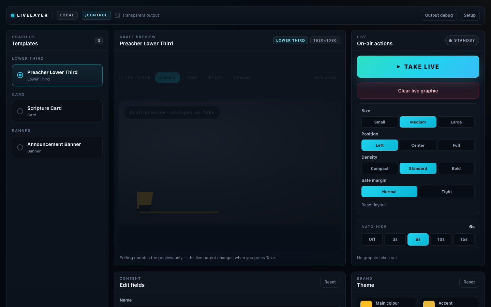

<p align="center">
  
</p>

# LiveLayer

**Local-first broadcast graphics for OBS — a control dock and a transparent output overlay, running entirely in the browser.**

LiveLayer gives small live-production teams a clean, OBS-native way to put lower
thirds, scripture, and announcements on a stream — without a native plugin, an
account, or the cloud. It runs as two browser surfaces you point OBS at:

- **`/control`** — the operator surface: choose a graphic, edit its text, preview it, take it live, clear it.
- **`/output`** — a transparent 1920×1080 overlay you add to OBS as a Browser Source.

> **Status: alpha (v0.1).** The core loop — templates, live preview, Take/Clear,
> auto-hide, presets, rundowns, import/export, and transparent output — works end
> to end. It is local-first; see [Known limitations](docs/KNOWN_LIMITATIONS.md).

## Screenshots



The screenshot above shows the desktop control surface. Use
[`docs/SCREENSHOT_GUIDE.md`](docs/SCREENSHOT_GUIDE.md) for a fuller capture set
covering the OBS dock layout and transparent output overlays.

## Who it's for

Church media teams, livestream operators, podcasters, schools, and small studios
who already run OBS and want repeatable, on-brand graphics without learning a
heavy motion-graphics tool.

## Why it exists

Most "stream graphics" options are either cloud SaaS (accounts, subscriptions,
latency) or full native plugins (install friction, platform lock-in). LiveLayer
is the in-between: a fast, local, browser-based control surface that treats OBS
as the compositor and keeps everything on your machine.

## Key features

- **Two-surface OBS workflow** — control dock + transparent Browser Source, no install.
- **Dock-first operator UX** — at narrow widths (OBS Custom Browser Dock) a guided
  `Graphic → Edit → Live` tab flow with a sticky status bar and an always-visible
  Take/Clear bar; at desktop widths a full studio dashboard. One route, responsive.
- **True preview parity** — the control preview renders through the *same* 1920×1080
  stage, scale, theme, and animation as `/output`, so what you see is what airs.
- **Expanded broadcast templates** — lower third, scripture, announcement, quote,
  event, sermon title, and fullscreen message graphics.
- **Take / Clear / auto-hide** — instant show/clear with optional self-clear (Off/3/6/10/15s).
- **Two motion styles** — a per-element *slide build* (default) and a flat *fade*
  crossfade, configured per template (with a per-instance override path).
- **Local assets** — upload logos and speaker headshots into same-origin IndexedDB,
  then reuse them in previews, presets, rundowns, and `/output`.
- **People and scripture helpers** — speaker profiles, headshot/logo references,
  book/chapter/verse picking, lookup across eleven public-domain translations
  (WEB, KJV, ASV, BBE, Darby, DRA, WEBBE, OEB-US, OEB-CW, YLT, Almeida), and manual
  paste fallback.
- **Voice assist preview** — type what the preacher said and get ranked candidate
  references to choose between. **No microphone, no speech provider, no model.**
  Nothing reaches the graphic until you accept a reading, and nothing reaches air
  until you press Take. See [`docs/ASR_EVALUATION.md`](docs/ASR_EVALUATION.md).
- **Brand theming** — primary/accent colours, local logo references, and reset-to-template.
- **Rundown queue** — build, edit, reorder, and operate an ordered set of graphic
  snapshots without changing `/output` until Take.
- **Import/export packs** — export and safely import a selected rundown as a
  `.livelayerpack`, remapping IDs and restoring referenced local assets.
- **Local presets** — save, recall, and remove full graphic setups (localStorage).
- **Transparent, resolution-independent output** — authored at a fixed 1920×1080 and
  scaled to any Browser Source size.

## Tech stack

- **React 18** + **TypeScript** (strict)
- **Vite 5** (dev server + build)
- **Zustand** for control-surface state; **Zod** for stored-data validation
- **react-router-dom** for the `/control` workspaces and the `/output`, `/setup` routes
- **Tailwind CSS 3** + a hand-authored CSS design system (`src/styles.css`)
- **Archivo** variable font for the broadcast type
- Cross-surface messaging via **BroadcastChannel** (with a `localStorage` fallback)

## Architecture (in brief)

A single-page app with no backend of its own, and an **optional** local relay process
for multi-device control:

- **`/output`** renders only the active graphic on a transparent body. Graphics are
  authored in absolute 1920×1080 pixels on a `GraphicStage` that scales uniformly to
  the Browser Source, so composition is identical at any size.
- **`/control`** is a layout route with four workspaces — **Studio**, **Scripture**,
  **Rundown** and **Library** — plus `/setup`, an OBS onboarding helper. One page owns
  the messaging channel and both Take paths, so there is a single command owner
  however the surface is laid out.
- Control sends `SHOW_GRAPHIC` / `CLEAR_ALL` over **BroadcastChannel**; `/output`
  listens and animates in/out. A `localStorage` mirror lets `/output` restore the last
  graphic on refresh.
- **Optional LAN relay.** Start `npm run lan:relay` and pass `?relay=<url>` to carry
  those same commands to a second machine or a tablet. The relay is **transport only**
  — it forwards messages. Uploaded assets, People, Saved Graphics, rundowns and
  presets stay in the browser that created them and do **not** travel through it.
  Clearing a stored relay needs an explicit `?relay=off`.
- Messaging is **one-way**: control publishes, output renders. Relay readiness means
  the relay answered and identified itself — it is **not** an acknowledgement that
  `/output` displayed anything, and the Program state models that honestly.
- State lives in a **Zustand** store; presets, brand overrides, and recents persist to
  `localStorage` (validated with **Zod** on read).

More detail: [`docs/ARCHITECTURE.md`](docs/ARCHITECTURE.md),
[`docs/NETWORK_OUTPUT_ARCHITECTURE.md`](docs/NETWORK_OUTPUT_ARCHITECTURE.md),
[`docs/CONTROL_UI_UX.md`](docs/CONTROL_UI_UX.md),
[`docs/DESIGN_SYSTEM.md`](docs/DESIGN_SYSTEM.md),
[`docs/TEMPLATE_SCHEMA.md`](docs/TEMPLATE_SCHEMA.md), and
[`docs/TEMPLATE_PACK_PLAN.md`](docs/TEMPLATE_PACK_PLAN.md).

## Run locally

```bash
npm install
npm run dev        # Vite dev server on http://127.0.0.1:4173
```

- Control: <http://127.0.0.1:4173/control>
- Output: <http://127.0.0.1:4173/output>
- Setup helper: <http://127.0.0.1:4173/setup>
- Build: `npm run build` (runs `tsc` then `vite build`)
- Verify: `npm run verify` (output isolation/transparency guard, asset-id message guard, production build)
- Route smoke: with a server running, `npm run smoke:routes` (point it elsewhere with
  `LIVELAYER_SMOKE_URL=http://127.0.0.1:4188`)
- LAN beta: `npm run dev:lan` plus `npm run lan:relay`, then open matching
  `?relay=http://<graphics-host-ip>:4174` URLs on `/control` and `/output`.

## Run the built app (production, no dev tree)

For a service, run the build rather than the dev server. Building needs the dev
dependencies; **serving does not**, which is what makes the build portable.

**On a machine with the repo installed** — build, then serve:

```bash
npm install && npm run build   # needs node_modules
npm run start                  # http://127.0.0.1:4173 — same origin as npm run dev
```

**On the service machine** — copy over just `dist/` and `scripts/` (keeping them
side by side) and run, with **only Node installed**, no `npm install`:

```bash
node scripts/serve-dist.mjs                 # 127.0.0.1:4173
node scripts/serve-dist.mjs --port 4188     # if 4173 is busy
node scripts/serve-dist.mjs --host 0.0.0.0  # reachable from the LAN
```

`npm run start` is that same command. Unlike `npm run preview`, which needs the
full dev dependency tree, `scripts/serve-dist.mjs` has no dependencies at all —
so `dist/` plus `scripts/` is a complete, runnable LiveLayer on a borrowed
laptop twenty minutes before a service.

It prints the exact `/control`, `/output` and `/setup` URLs to paste into OBS,
and refuses to start on a port browsers block (an OBS Browser Source is
Chromium, so those give you a blank source and no error to explain it).
It defaults to port 4173 on purpose: that is the dev and preview port too, so
the assets, People, presets and rundowns an operator built up while testing are
the same origin's, and still there. Moving it with `--port` moves the origin,
and those libraries do not follow.

For a second device, serve on the LAN and run the relay beside it. On the
service machine (`scripts/livelayer-lan-relay.mjs` is dependency-free too, so
copy it across with the rest):

```bash
node scripts/serve-dist.mjs --host 0.0.0.0
node scripts/livelayer-lan-relay.mjs
```

With the repo installed, those are `npm run start:lan` and `npm run lan:relay`.
The server prints the LAN address to use; open `/setup` there to copy the
matching `?relay=` control and output URLs.

## OBS setup

1. **Output** — add a **Browser Source**, URL `http://127.0.0.1:4173/output`,
   size `1920 × 1080`, transparent background. Place it above your camera/video.
2. **Control** — add a **Custom Browser Dock** (`View → Docks → Custom Browser Docks`),
   URL `http://127.0.0.1:4173/control`.
3. Pick a graphic, edit the text, press **Take live**; **Clear** to remove it.

Need to send the finished output to another PC or Mac? Render LiveLayer inside
OBS first, then send the OBS scene/program over NDI using an OBS NDI workflow
such as DistroAV/NDI. LiveLayer itself does not emit native NDI.

Need a second PC or tablet to press Take/Clear? Start the LAN relay on the
graphics machine and use `/setup` to copy the beta relay URLs. This carries live
commands only; uploaded assets and saved libraries are still browser-local.

Full steps: [`docs/OBS_SETUP.md`](docs/OBS_SETUP.md). Fast visual QA without OBS:
open <http://127.0.0.1:4173/seed-test.html>.

## Documentation

- [QA checklist](docs/QA_CHECKLIST.md) · [Screenshot guide](docs/SCREENSHOT_GUIDE.md)
- [Known limitations](docs/KNOWN_LIMITATIONS.md) · [Roadmap](docs/ROADMAP.md)
- [Architecture](docs/ARCHITECTURE.md) · [Control UI/UX](docs/CONTROL_UI_UX.md) · [Design system](docs/DESIGN_SYSTEM.md) · [Template schema](docs/TEMPLATE_SCHEMA.md)
- [Speech recognition evaluation](docs/ASR_EVALUATION.md) — DONDO audit, reference-outcome harness, benchmark plan (no provider selected)
- [Network output architecture](docs/NETWORK_OUTPUT_ARCHITECTURE.md) · [NDI workflow](docs/NDI_WORKFLOW.md) · [Cloud architecture](docs/CLOUD_ARCHITECTURE.md) · [Template pack plan](docs/TEMPLATE_PACK_PLAN.md)

## Roadmap & limitations

Honest about what's not here yet — local-first, manual OBS setup,
no cloud/accounts, no visual builder, no microphone or speech recognition. See [Known limitations](docs/KNOWN_LIMITATIONS.md)
and the [Roadmap](docs/ROADMAP.md).

## License

Not yet specified (alpha). Add a license before public release.
